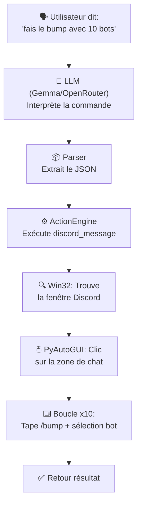
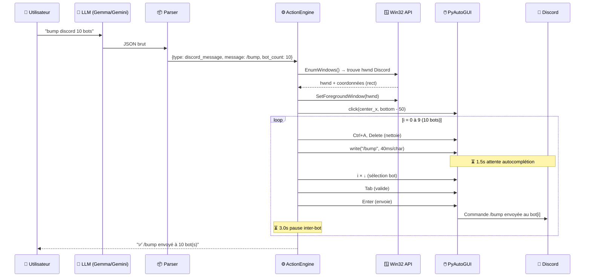

# 🔍 Comment l'Agent fait le Bump Discord via 10 Bots — Explication Ultra-Détaillée

## Vue d'ensemble du flux complet

Quand tu dis à l'agent **"fais le bump sur discord avec 10 bots"**, voici ce qui se passe, étape par étape, du début à la fin.



---

## Phase 1 — L'Utilisateur Parle → Le LLM Comprend

### Fichier : [config.py](file:///c:/Users/adamm/Desktop/.y proj/config.py) (lignes 118-180)

Le **System Prompt** dans `config.py` est la clé. Il contient des instructions précises pour le LLM :

```python
SYSTEM_PROMPT = """Tu es un assistant IA local qui contrôle le PC de l'utilisateur.
Tu reçois des commandes en langage naturel (français) et tu dois répondre en JSON valide.
...
Types d'actions disponibles :
   - {"type": "discord_message", "message": "texte ou /commande", "bot_count": 1}
...
"""
```

Et un **exemple concret** est fourni au LLM (few-shot) :

```python
# Ligne 172-173 de config.py
Commande: "fais le bump sur discord avec 5 bots"
{"response": "D'accord, je lance la commande /bump sur les 5 premiers bots.", 
 "actions": [{"type": "discord_message", "message": "/bump", "bot_count": 5}]}
```

> [!IMPORTANT]
> **Point intéressant** : Le LLM ne "sait" pas faire de bump Discord nativement. C'est le **System Prompt** qui lui enseigne la syntaxe exacte du JSON à générer. Le few-shot example (ligne 172-173) est crucial : il montre au LLM comment mapper "bump avec X bots" vers `{"type": "discord_message", "message": "/bump", "bot_count": X}`.

### Fichier : [llm.py](file:///c:/Users/adamm/Desktop/.y proj/agent/llm.py)

Le message de l'utilisateur est envoyé au LLM via `send_message()` ou `send_message_sync()`. Le LLM retourne quelque chose comme :

```json
{
  "response": "D'accord, je lance la commande /bump sur les 10 premiers bots.",
  "actions": [
    {"type": "discord_message", "message": "/bump", "bot_count": 10}
  ]
}
```

> [!TIP]
> **Point intéressant** : L'historique de conversation (`conversation_history`) est conservé et limité à 30 messages (`MAX_HISTORY_MESSAGES = 30`). Ça permet au LLM de se souvenir du contexte, mais sans dépasser la fenêtre de contexte du modèle.

---

## Phase 2 — Le Parser Extrait le JSON

### Fichier : [parser.py](file:///c:/Users/adamm/Desktop/.y proj/agent/parser.py)

La réponse brute du LLM (qui est du texte) est parsée par `parse_llm_response()` :

```python
def parse_llm_response(raw_response):
    json_str = _extract_json(raw_response)  # Extrait le JSON même s'il est entouré de texte
    
    if json_str:
        data = json.loads(json_str)
        response_text = data.get("response", "")
        actions = data.get("actions", [])
        
        # Valide chaque action
        validated_actions = []
        for action in actions:
            validated = _validate_action(action)  # Vérifie type + champs requis
            if validated:
                validated_actions.append(validated)
```

### La validation (`_validate_action`) — Ligne 117-171

```python
valid_types = {
    ...
    "discord_message": ["message"],  # Champ "message" est requis
    ...
}
```

> [!NOTE]
> **Point intéressant** : Le parser est **tolérant**. La fonction `_extract_json()` utilise un compteur de brackets `{ }` intelligent qui peut extraire du JSON même si le LLM ajoute du texte autour (ex: "Voici la commande : ```json { ... } ```"). C'est important car les LLM ne retournent pas toujours du JSON pur.

Le résultat de cette phase est un dict structuré :
```python
{
    "response": "D'accord, je lance la commande /bump sur les 10 premiers bots.",
    "actions": [
        {"type": "discord_message", "message": "/bump", "bot_count": 10}
    ],
    "error": None
}
```

---

## Phase 3 — L'ActionEngine Exécute la Commande

### Fichier : [actions.py](file:///c:/Users/adamm/Desktop/.y proj/agent/actions.py) — `_handle_discord_message()` (lignes 743-902)

C'est ici que toute la magie opère. Décomposons le handler en **sous-étapes** :

### 3.1 — Extraction des paramètres (lignes 752-757)

```python
def _handle_discord_message(self, action):
    message = action.get("message", "").strip()       # → "/bump"
    bot_count = int(action.get("bot_count", 1))        # → 10
    if not message:
        return {"success": False, "message": "Aucun message à envoyer"}
```

> [!NOTE]
> `bot_count` a un **défaut de 1**, donc si le LLM oublie de spécifier le nombre de bots, ça marche quand même avec un seul bot.

---

### 3.2 — Localisation de la fenêtre Discord (lignes 759-775)

L'agent utilise l'API **Win32** pour trouver la fenêtre Discord :

```python
hwnd_discord = None
import win32gui
import win32con

def enum_windows_callback(hwnd, extra):
    nonlocal hwnd_discord
    if win32gui.IsWindowVisible(hwnd):
        title = win32gui.GetWindowText(hwnd).lower()
        if "discord" in title and "agent pc" not in title and "overlay" not in title:
            hwnd_discord = hwnd
    return True

win32gui.EnumWindows(enum_windows_callback, None)
```

> [!IMPORTANT]
> **Points intéressants** :
> - `EnumWindows` parcourt **toutes les fenêtres visibles** du système d'exploitation
> - Le filtre exclut intelligemment les fenêtres de l'agent lui-même (`"agent pc" not in title`) et l'overlay Discord (`"overlay" not in title`)
> - Le `hwnd` (handle window) est un identifiant unique Windows pour chaque fenêtre

---

### 3.3 — Activation de la fenêtre Discord (lignes 779-805)

Si la fenêtre est trouvée :

```python
if hwnd_discord:
    # Restaurer si minimisée
    if win32gui.IsIconic(hwnd_discord):
        win32gui.ShowWindow(hwnd_discord, win32con.SW_RESTORE)
        time.sleep(0.5)
    
    # Mettre au premier plan
    win32gui.SetForegroundWindow(hwnd_discord)
    time.sleep(0.5)
    
    # Calculer les coordonnées de clic
    rect = win32gui.GetWindowRect(hwnd_discord)
    left, top, right, bottom = rect
    width = right - left
    
    # Clic au centre horizontal, 50px au-dessus du bas
    click_x = left + (width // 2)
    click_y = bottom - 50
```

> [!TIP]
> **Point intéressant — Le calcul de position** :
> - `click_x = left + (width // 2)` → Centre horizontal de la fenêtre Discord
> - `click_y = bottom - 50` → 50 pixels au-dessus du bas de la fenêtre
> 
> Pourquoi 50px au-dessus du bas ? Parce que la **zone de saisie de texte** de Discord est toujours en bas de la fenêtre ! Le 50px est une marge pour éviter de cliquer sur la barre des tâches Windows si Discord est maximisé.

---

### 3.4 — Fallback : Si Discord n'est pas trouvé (lignes 809-836)

```python
if click_x is None or click_y is None:
    # Relancer Discord
    from config import APPS
    discord_cmd = APPS.get("discord", "")
    discord_cmd = os.path.expandvars(discord_cmd)
    subprocess.Popen(discord_cmd, shell=True)
    
    # Attendre 4 secondes que Discord s'ouvre
    time.sleep(4)
    
    # Cliquer au centre de l'écran/moniteur sélectionné
    region = self._get_selected_monitor_rect()
    if region:
        mon_x, mon_y, mon_w, mon_h = region
        click_x = mon_x + (mon_w // 2)
        click_y = mon_y + mon_h - 80
```

> [!NOTE]
> **Point intéressant** : La commande Discord dans `config.py` est :
> ```
> C:\Users\%USERNAME%\AppData\Local\Discord\Update.exe --processStart Discord.exe
> ```
> C'est la méthode officielle de Discord pour lancer l'app. `Update.exe` est le launcher Electron qui vérifie les mises à jour puis démarre `Discord.exe`.

---

### 3.5 — ⭐ LA BOUCLE PRINCIPALE : Le Bump sur 10 Bots (lignes 838-876)

**C'est la partie la plus intéressante** — voici le cœur du mécanisme :

```python
# Cliquer dans la zone de saisie Discord
pyautogui.click(click_x, click_y)
time.sleep(0.5)

is_slash = message.startswith("/")  # True pour "/bump"

if is_slash:
    # BOUCLE SUR LES 10 BOTS
    for i in range(bot_count):  # i = 0, 1, 2, ..., 9
        
        # 1. Vider le champ de texte
        pyautogui.hotkey("ctrl", "a")     # Sélectionner tout
        time.sleep(0.1)
        pyautogui.press("delete")          # Supprimer
        time.sleep(0.1)

        # 2. Taper la commande slash caractère par caractère
        pyautogui.write(message, interval=0.04)  # tape "/bump" à 40ms/caractère
        
        # 3. Attendre que le menu d'autocomplétion Discord apparaisse
        time.sleep(1.5)

        # 4. Naviguer vers le i-ème bot dans le menu
        for _ in range(i):
            pyautogui.press("down")        # Flèche bas
            time.sleep(0.1)

        # 5. Valider la sélection du bot
        pyautogui.press("tab")             # Tab sélectionne l'entrée
        time.sleep(0.5)
        
        # 6. Envoyer la commande
        pyautogui.press("enter")
        
        # 7. Attendre 3 secondes avant le prochain bot
        if i < bot_count - 1:
            time.sleep(3.0)
```

> [!IMPORTANT]
> **Explication du mécanisme d'autocomplétion Discord** :
> 
> Quand tu tapes `/bump` dans Discord, un **menu d'autocomplétion** apparaît avec tous les bots qui ont enregistré une commande `/bump` :
> 
> ```
> ┌──────────────────────────────┐
> │  /bump - Bot1 (DISBOARD)    │  ← i=0 (sélectionné par défaut)
> │  /bump - Bot2 (Dissoku)     │  ← i=1 (1x flèche bas)
> │  /bump - Bot3 (Open Bump)   │  ← i=2 (2x flèche bas)
> │  /bump - Bot4 (UnbelievaBoat│  ← i=3 (3x flèche bas)
> │  ...                        │
> │  /bump - Bot10              │  ← i=9 (9x flèche bas)
> └──────────────────────────────┘
> ```
> 
> L'astuce est simple mais brillante :
> - **Bot 1** (i=0) : 0 fois `↓` → directement `Tab` → `Enter`
> - **Bot 2** (i=1) : 1 fois `↓` → `Tab` → `Enter`
> - **Bot 3** (i=2) : 2 fois `↓` → `Tab` → `Enter`
> - ...
> - **Bot 10** (i=9) : 9 fois `↓` → `Tab` → `Enter`

---

## Timeline Complète d'un Bump à 10 Bots

Voici un chronogramme des événements avec les délais :

```
T+0.0s  → Clic sur la zone de saisie Discord
T+0.5s  → [Bot 1] Ctrl+A → Delete → Tape "/bump" (200ms)
T+2.3s  → [Bot 1] 1.5s d'attente pour l'autocomplétion
T+2.3s  → [Bot 1] 0x ↓ (c'est le premier = déjà sélectionné)
T+2.8s  → [Bot 1] Tab (valide) → 0.5s
T+3.3s  → [Bot 1] Enter (envoie) → 3.0s d'attente
T+6.3s  → [Bot 2] Ctrl+A → Delete → Tape "/bump"
T+9.1s  → [Bot 2] 1x ↓ → Tab → Enter → 3.0s d'attente
T+12.1s → [Bot 3] Ctrl+A → Delete → Tape "/bump"
T+14.9s → [Bot 3] 2x ↓ → Tab → Enter → 3.0s d'attente
...
T+~50s  → [Bot 10] Ctrl+A → Delete → Tape "/bump"
T+~53s  → [Bot 10] 9x ↓ → Tab → Enter
T+~53s  → ✅ Terminé ! Retour du résultat
```

> [!TIP]
> **Temps total estimé** : ~50-55 secondes pour bumper 10 bots. Chaque itération prend environ **5-6 secondes** (frappe + attente autocomplétion + navigation + envoi + pause inter-bot de 3s).

---

## Points Intéressants & Subtilités

### 🎯 1. Pourquoi `pyautogui.write()` et pas `pyperclip` pour les commandes slash ?

```python
if is_slash:
    pyautogui.write(message, interval=0.04)  # Frappe caractère par caractère
else:
    pyperclip.copy(message)                   # Copie dans le presse-papiers
    pyautogui.hotkey("ctrl", "v")             # Colle
```

**Réponse** : Les commandes slash Discord **DOIVENT** être tapées caractère par caractère pour déclencher le menu d'autocomplétion. Si tu colles `/bump` d'un coup avec Ctrl+V, Discord ne détecte pas le `/` initial comme un déclencheur de commande slash → le menu n'apparaît pas → tout échoue.

Pour les messages normaux (non-slash), on utilise le presse-papiers car c'est plus rapide et supporte les caractères Unicode/accentués.

### 🎯 2. Le `interval=0.04` (40ms par caractère)

```python
pyautogui.write(message, interval=0.04)
```

Ce délai de 40ms entre chaque caractère est calibré pour :
- Être assez lent pour que Discord enregistre chaque frappe
- Être assez rapide pour ne pas perdre trop de temps
- Correspondre au `typing_speed: 0.04` dans [discord_bump_gui_config.json](file:///c:/Users/adamm/Desktop/.y proj/discord_bump_gui_config.json)

### 🎯 3. Le délai de 1.5s pour l'autocomplétion

```python
time.sleep(1.5)
```

Discord a besoin d'environ 1 à 1.5 secondes pour :
1. Détecter que c'est une commande slash
2. Interroger ses serveurs pour les bots disponibles
3. Afficher le menu popup d'autocomplétion

Si ce délai est trop court, le menu n'est pas encore affiché et les `↓` n'ont pas d'effet.

### 🎯 4. Le délai de 3s entre chaque bot

```python
if i < bot_count - 1:
    time.sleep(3.0)
```

Ce délai est crucial pour :
- Laisser Discord envoyer la commande au bot
- Laisser le bot répondre (souvent avec un embed)
- Éviter le rate-limiting de Discord (spam prevention)
- Nettoyer l'état de la zone de saisie

### 🎯 5. Le `Ctrl+A → Delete` avant chaque itération

```python
pyautogui.hotkey("ctrl", "a")
time.sleep(0.1)
pyautogui.press("delete")
```

Cela vide complètement la zone de texte avant de taper la nouvelle commande. C'est une **mesure de sécurité** : si le bot précédent a laissé du texte résiduel, ou si Discord a pré-rempli quelque chose, tout est nettoyé.

### 🎯 6. `Tab` vs `Enter` pour la sélection

```python
pyautogui.press("tab")    # Valide le choix dans l'autocomplétion
time.sleep(0.5)
pyautogui.press("enter")  # Envoie la commande complète
```

Dans Discord :
- `Tab` = **valide l'élément sélectionné dans l'autocomplétion** (insère la commande complète)
- `Enter` = **envoie le message/commande** dans le chat

Ce sont deux actions distinctes et l'ordre est important !

---

## Le Script PowerShell Alternatif

### Fichier : [discord_send.ps1](file:///c:/Users/adamm/Desktop/.y proj/agent/discord_send.ps1)

Il existe aussi un script PowerShell pour envoyer des messages simples (non-slash) :

```powershell
# 1. Trouve le PID Discord via Get-Process + tasklist /V
# 2. Active la fenêtre via WScript.Shell COM → VisualBasic fallback
# 3. Copie le message via [System.Windows.Forms.Clipboard]::SetText()
# 4. Colle avec Ctrl+V et envoie avec Enter
```

> [!NOTE]
> Ce script n'est **PAS** utilisé pour le bump. Il sert uniquement pour les messages texte classiques et utilise une approche COM Windows plus robuste mais incompatible avec les commandes slash.

---

## Architecture Complète



---

## Résumé des Fichiers Impliqués

| Fichier | Rôle | Lignes clés |
|---------|------|-------------|
| [config.py](file:///c:/Users/adamm/Desktop/.y proj/config.py) | System Prompt + exemple few-shot pour le LLM | L157, L172-173 |
| [llm.py](file:///c:/Users/adamm/Desktop/.y proj/agent/llm.py) | Envoie la commande au LLM et reçoit le JSON | L108-200 |
| [parser.py](file:///c:/Users/adamm/Desktop/.y proj/agent/parser.py) | Extrait et valide le JSON de la réponse LLM | L10-66, L117-171 |
| [actions.py](file:///c:/Users/adamm/Desktop/.y proj/agent/actions.py) | **Le cœur** — exécute le bump via Win32 + PyAutoGUI | L743-902 |
| [discord_send.ps1](file:///c:/Users/adamm/Desktop/.y proj/agent/discord_send.ps1) | Script alternatif (messages simples uniquement) | L1-124 |
| [discord_bump_gui_config.json](file:///c:/Users/adamm/Desktop/.y proj/discord_bump_gui_config.json) | Config GUI pour le bump (interval, bots_count, etc.) | Tout |

---

## ⚠️ Limitations et Risques

1. **Fragile par nature** : C'est de l'automatisation GUI (pas d'API Discord). Si Discord change son UI, les timings ou la position du menu d'autocomplétion, ça casse.
2. **L'utilisateur ne doit pas toucher la souris/clavier** pendant le bump (50-55 secondes pour 10 bots).
3. **Le rate-limiting Discord** : Envoyer trop de commandes trop vite peut déclencher des restrictions.
4. **L'ordre des bots dans l'autocomplétion** n'est pas garanti — Discord peut changer l'ordre selon ses propres algorithmes.
